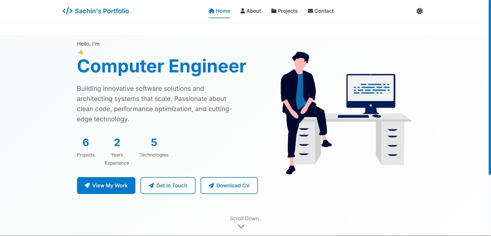
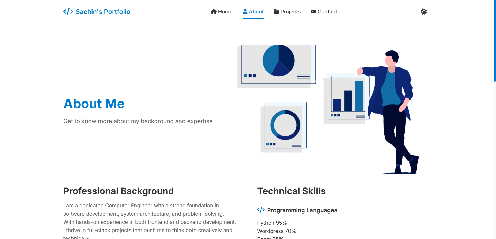
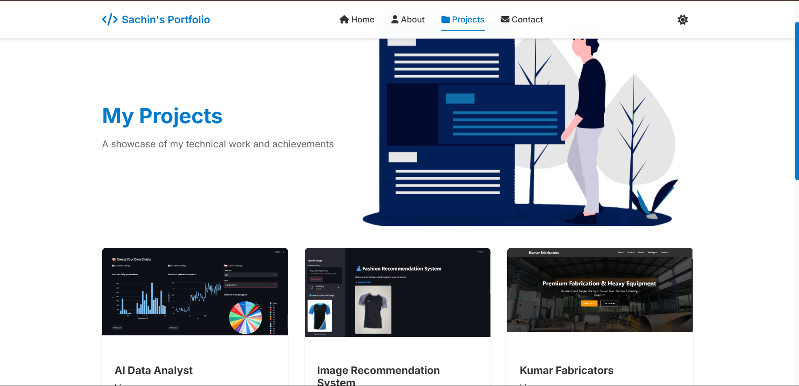
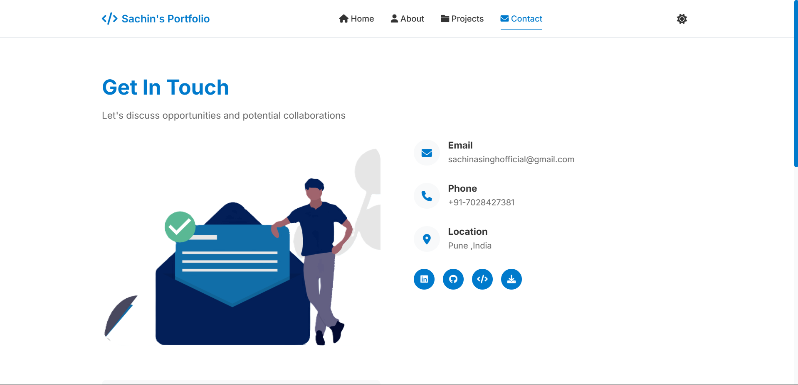

# 💼 Sachin Singh – Developer Portfolio

Welcome to my personal portfolio! This project is a clean, responsive, and animated portfolio site built with plain HTML, CSS, and JavaScript. It showcases my background, technical skills, and a selection of my best projects with live demos and GitHub links.

---

## 🌐 Live Demo

👉 [Click here to view the portfolio](https://your-deployed-site-link.com)  
📌 *(Replace the link with your actual deployed URL)*

---

## 🖼️ Preview Screens

| Home Page | About Page | Projects Page | Contact Page |
|-----------|------------|---------------|--------------|
|  |  |  |  |

> 📁 *Put all these screenshots in a `/screenshots/` folder in your repo.*

---

## 🚀 Features

- Single Page Application feel with smooth transitions
- Responsive layout with Flexbox & Grid
- Scroll-based animations
- Dark mode toggle
- Interactive project cards with GitHub and Live links
- Contact form with client-side validation
- Typing effect for Hero section

---

## 📁 Folder Structure

```bash
├── index.html
├── css/
│   └── styles.css
├── js/
│   └── main.js
├── projects/
│   ├── AIData.png
│   ├── ImageRecc.png
│   ├── DOJ.png
│   ├── JS.png
│   ├── todo.png
│   └── KF.png
├── screenshots/
│   ├── home.png
│   ├── about.png
│   ├── projects.png
│   └── contact.png
└── README.md
## 🛠️ Tech Stack

- **Frontend:** HTML5, CSS3, JavaScript (Vanilla)
- **UI Libraries:** Font Awesome, Google Fonts
- **Animation:** Custom CSS + JS events

---

## 📬 Contact

- 📧 **Email:** [sachinasinghofficial@gmail.com](mailto:sachinasinghofficial@gmail.com)
- 💼 **LinkedIn:** [linkedin.com/in/sachinsingh008](https://www.linkedin.com/in/sachinsingh008)
- 💻 **GitHub:** [github.com/SachinSingh008](https://github.com/SachinSingh008)

---

## 📝 License

**MIT License** – Free to use for educational and personal portfolio purposes.